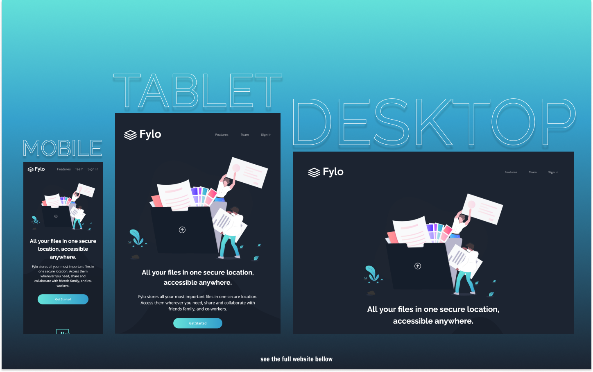

# Frontend Mentor - Fylo Dark Theme Landing Page Solution

This is a solution to the [Fylo Dark Theme Landing Page Challenge on Frontend Mentor](https://www.frontendmentor.io/challenges/fylo-dark-theme-landing-page-5ca5f2d21e82137ec91a50fd).

## Table of contents

- [Overview](#overview)
  - [The challenge](#the-challenge)
  - [Screenshot](#screenshot)
  - [Links](#links)
- [My process](#my-process)
  - [Built with](#built-with)
  - [What I learned](#what-i-learned)
- [Author](#author)

## Overview

### The challenge

Users should be able to:

- View the optimal layout for the site depending on their device's screen size
- See hover states for all interactive elements on the page
- Show an error message if the user types an invalid email

### Screenshot

### Links

- Live Site URL: [https://kens-visuals.github.io/fylo-dark-theme-landing-page/](https://kens-visuals.github.io/fylo-dark-theme-landing-page/)
- Solution URL: [https://www.frontendmentor.io/solutions/fylo-dark-theme-landing-page-with-vanilla-js-scss-and-bem-KaoA6v6wj](https://www.frontendmentor.io/solutions/fylo-dark-theme-landing-page-with-vanilla-js-scss-and-bem-KaoA6v6wj)

## My process

### Built with

- Semantic HTML5 markup
- SCSS custom properties
- CSS Flexbox
- CSS Grid
- Vanilla JS
- Mobile-first workflow

### What I learned

The overall layout was simple and easy to put together, the only tricky part was the background pattern. As for the last couple of projects, I added some `IntervalObservers` as well. I really like how they can make a single page simple layout to be more interactive. That's why I tend to add some simple animations ever since I've learned about this technique. In brief, fun and cool project, I'd also like if it had a theme switcher from dark to light. I'd implement it by myself, but I still have two projects left to do.

## Author

- Frontend Mentor - [@kens-visuals](https://www.frontendmentor.io/profile/kens-visuals)
- Codewars - [@kens_visuals](https://www.codewars.com/users/kens_visuals)
- CodePen - [@kens-visuals](https://codepen.io/kens-visuals)
